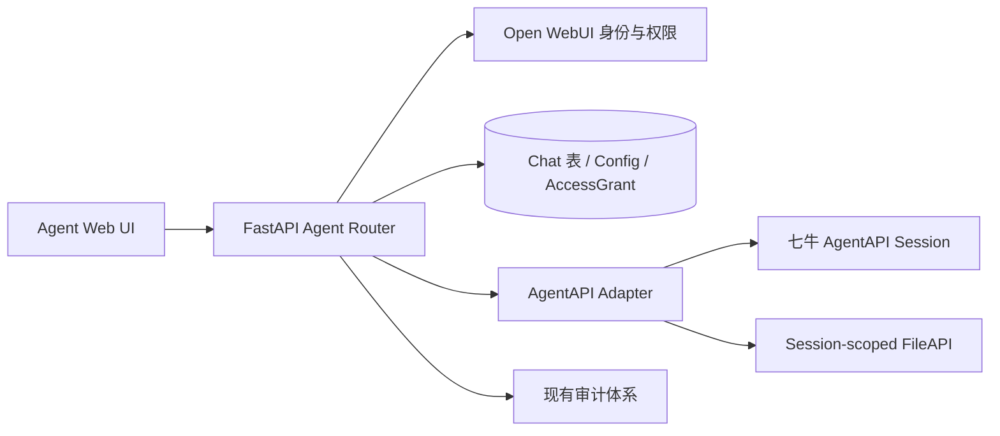

# Open WebUI Agent 模式轻量技术方案

七牛 AgentAPI 的已验证请求、响应和适配器映射见：[AgentAPI 接口契约](AGENT_MODE_AGENTAPI_REFERENCE.md)。

## 1. 设计原则

Agent 与 Chat 是两种平级会话模式，但 Agent 的消息、状态和文件全部由七牛 AgentAPI Session 提供。Open WebUI 保存最小的本地会话索引，用于用户归属、权限、会话列表和管理操作。

本方案不在 Open WebUI 保存 Agent 消息正文、事件历史或文件副本，也不为每个 Session 建立本地任务表。加载 Agent 会话时，后端完成权限校验后，代理请求到对应 AgentAPI Session 的分页接口和 Session FileAPI。

核心约束：

1. Agent 会话创建时确定模式，不能转换为 Chat；Chat 也不能转换为 Agent。
2. 七牛 AgentAPI Session 是 Agent 消息、执行状态和文件的唯一事实源。
3. Open WebUI 只保存本地 Chat 索引和上游 Session 绑定，不保存 Agent 消息内容。
4. Agent 长任务由七牛侧持续执行；第一版使用前端事件轮询，不使用进程内后台任务、Socket.IO 补发或 SSE。
5. 页面关闭时停止轮询；浏览器断开或 Open WebUI 重启不影响上游 Session，重新进入页面后从上游历史增量恢复。
6. 第一版只支持文本输入，不提供输入文件上传或 Session resource 挂载；Agent 输出文件仍通过对应 Session 的 FileAPI 实时列举、预览和流式下载，不使用本地 FileAPI、`file` 表或对象存储。
7. API Key 始终只存在于后端配置和后端到 AgentAPI 的请求中。
8. Open WebUI 的归档只修改本地 `chat.archived`，不归档、中断或修改上游 AgentAPI Session；取消归档后仍可继续访问原 Session。
9. 管理员可以全局只读所有用户的 Agent 会话、事件、状态、输出文件和用量，但不能代替会话 owner 发送消息或中断任务。

目前已通过七牛 AgentAPI 测试接口确认：

- `GET /v1/sessions/{session_id}` 返回 Session 状态、Agent、Environment、metadata 和更新时间；
- `GET /v1/sessions/{session_id}/events?limit={n}` 返回 `data` 和 `next_page`，事件包含稳定 `id`、`sequence_number`、`processed_at`；
- 继续请求 `page={next_page}` 可以读取下一页历史事件；
- `POST /v1/sessions/{session_id}/events` 接受 `user.message`，响应返回已接收事件；
- `GET /v1/files?scope_id={session_id}&limit={n}` 返回 Session 范围内文件和分页字段；
- 文件元数据包含 `scope: {type: "session", id: session_id}`，内容接口可以直接流式读取。

Session 和 FileAPI 按长期保留前提使用。正式接入前仍需确认消息提交是否支持显式幂等 request ID；若上游没有幂等能力，才增加本地去重表。

## 2. 现有代码复用范围

| 现有能力 | Agent 使用方式 |
| --- | --- |
| `backend/open_webui/main.py` | 挂载 Agent 路由 |
| `models/chats.py` 的 `chat` 表 | 保存 Agent 本地索引、owner、标题、归档、文件夹和上游 Session 绑定 |
| `Chat.mode` | 区分 `chat` 与 `agent` |
| `models/config.py` 的 Config | 保存 AgentAPI 地址、启用状态、Key 掩码状态和 Agent 配置 |
| `access_grant`、Groups | 控制 Agent 查看/使用权限 |
| `ENABLE_ADMIN_CHAT_ACCESS` | 不限制 Agent 会话；Agent 模式明确允许管理员全局只读所有用户会话 |
| `AuditLoggingMiddleware` | 记录配置、查看、文件下载、删除和管理行为 |
| `models/files.py`、`routers/files.py` | 不用于 Agent 文件内容；只借鉴现有预览和鉴权交互 |
| Socket.IO | Agent v1 不依赖；实时性由事件分页轮询实现 |
| SQLite | 单实例默认数据库，保存本地索引和权限数据 |

## 3. 系统架构



### 3.1 进程模型

单实例只运行现有 Open WebUI Web 进程和数据库：

```text
Docker open-webui
  ├── FastAPI / Svelte
  ├── SQLite: /app/backend/data/webui.db
  └── AgentAPI Adapter -> 七牛 AgentAPI
```

Agent 不需要单独 Worker、Redis、S3 或本地文件目录。七牛 AgentAPI Session 负责长任务的持续执行和历史保留。

## 4. 最小本地数据设计

### 4.1 复用 `chat` 表作为会话索引

创建 Agent 会话时，新增一条 `chat` 记录：

| 字段 | 用途 |
| --- | --- |
| `id` | Open WebUI 本地会话 ID，前端只使用此 ID |
| `user_id` | 会话 owner |
| `mode` | 固定为 `agent` |
| `title` | 本地显示标题 |
| `archived`、`pinned`、`folder_id` | 复用现有会话管理能力；`archived` 仅表示 Open WebUI 本地隐藏状态 |
| `created_at`、`updated_at` | 本地列表排序和未读提示 |
| `meta.agentapi.profile_id` | 创建时使用的 Agent 配置 ID |
| `meta.agentapi.profile_name` | 创建时的 Agent 名称快照 |
| `meta.agentapi.session_id` | 七牛 AgentAPI Session ID |
| `meta.agentapi.agent_id` | 创建时 Agent ID 快照 |
| `meta.agentapi.agent_version` | 创建时 Version 快照 |
| `meta.agentapi.environment_id` | 创建时 Environment 快照 |

`chat.chat` 只保留最小结构，不写入 Agent 消息和事件；Agent 不双写到 `chat_message`。本地 Chat 行存在的目的是提供 owner、管理员范围、列表、归档、删除和审计关联。

### 4.2 Agent 配置

第一版可复用现有 Config JSON 保存：

```text
agentapi.enabled
agentapi.base_url
agentapi.api_key
agentapi.profiles[]
```

每个 profile 至少包含：

```json
{
  "id": "internal-profile-id",
  "name": "报告 Agent",
  "description": "...",
  "agent_id": "qiniu-agent-id",
  "agent_version": 1,
  "environment_id": "qiniu-environment-id",
  "enabled": true,
  "access_grants": []
}
```

Agent 配置授权使用现有 user/group grant 语义：`read` 表示可以看到 Agent，`write` 表示可以创建会话和发送消息。管理员配置权限继续使用现有 workspace/admin 权限。

### 4.3 可选幂等表

如果七牛消息提交接口原生支持幂等 `request_id`，不增加任何新表，直接把前端 `client_request_id` 传给上游。

如果七牛不提供幂等能力，只增加一张很小的 `agent_request_dedupe` 表：

| 字段 | 用途 |
| --- | --- |
| `session_id` | 本地 Chat ID 或上游 Session ID |
| `client_request_id` | 客户端生成的幂等键 |
| `upstream_request_id` | 上游确认 ID |
| `created_at` | TTL 清理依据 |

唯一约束为 `(session_id, client_request_id)`。该表只解决重复提交，不保存消息内容、事件或文件。

## 5. AgentAPI 适配层

新增轻量适配模块：

```text
backend/open_webui/utils/agentapi.py
```

适配器使用七牛 AgentAPI 官方推荐的 `anthropic` Python SDK，通过 `base_url` 指向七牛服务。SDK 负责认证、Session、事件分页和 FileAPI 请求；适配器负责 Open WebUI 权限校验、Session 绑定、`extra_body` 请求格式兼容和原始响应透传。完整 SDK 调用和分页注意事项见 [AgentAPI 接口契约](AGENT_MODE_AGENTAPI_REFERENCE.md)。

业务路由不直接拼接七牛 URL。适配层负责鉴权、超时、错误转换、游标和流式文件代理，提供：

```text
verify_connection(config)
create_session(agent_snapshot) -> upstream_session
get_session(upstream_session_id) -> session_status
submit_message(upstream_session_id, request_id, content) -> ack
list_session_events(upstream_session_id, page, limit, order, created_at_gte) -> raw_event_page
list_session_files(upstream_session_id) -> file_page
stream_session_file(upstream_session_id, file_id, range_header) -> byte_stream
cancel_session_run(upstream_session_id, upstream_run_id)
delete_session(upstream_session_id)
```

适配层不把上游事件重塑为 Open WebUI Message。JSON 接口尽量原样返回 AgentAPI 的完整响应信封、事件字段和未知扩展字段，包括 `data`、`next_page`、事件 `id`、`type`、`sequence_number`、时间、内容和结构化 payload。Open WebUI 自己需要补充的信息放入独立的 `_open_webui` 命名空间；API Key、认证头和不安全的上游响应头不得透传。

每个 `agent.message` 按上游事件边界返回，前端逐条渲染并以事件 `id` 做 upsert。Open WebUI 不把这些事件写入数据库。业务判断可使用 SDK typed object，代理响应使用 `with_raw_response` 保留原始 JSON 和未知字段。

## 6. 会话和消息流程

### 6.1 创建会话

1. 用户选择已授权且启用的 Agent。
2. 后端检查 Agent `write` 权限和 AgentAPI 全局启用状态。
3. 后端使用创建时的 Agent ID、Version、Environment 调用 AgentAPI 创建 Session。
4. 上游返回 Session ID 后，写入一条 `chat.mode='agent'` 的本地索引记录和配置快照。
5. 本地写入失败时，调用上游删除 Session，避免产生孤儿 Session。

### 6.2 加载会话

1. 浏览器只提交本地 `chat_id`，不提交可任意访问的上游 Session ID。
2. 后端按 `chat_id` 查询本地 Chat 行并执行 owner/admin 权限检查。
3. 后端从 `meta.agentapi.session_id` 读取上游 Session ID。
4. 后端调用 AgentAPI Session 状态和事件分页接口。
5. 分别原样返回上游事件分页信封和 Session 状态；需要附加的本地会话元数据放在 `_open_webui` 下。

刷新、重新登录和 Web 重启都重复上述流程，因此不依赖本地消息缓存。

### 6.3 发送消息

1. 第一版只提交文本；不显示输入文件选择器，也不调用 AgentAPI 文件上传或 Session resource 接口。
2. 前端立即显示本地 pending 用户消息，不要求先写入 Open WebUI 数据库。
3. 前端生成 `client_request_id`，调用 Agent 消息提交接口。
4. 后端校验本地会话权限、Agent 会话状态和请求幂等键。
5. 后端将消息提交到同一个上游 Session，并尽量原样返回上游 ack。
6. 前端立即执行一次事件增量同步，之后按 Session 状态继续轮询。
7. 页面关闭后停止轮询，AgentAPI 继续执行；用户再次进入时从上游分页加载完整结果。

### 6.4 轮询策略

- 首次进入页面时查询一次 Session 状态，并以 `order=asc` 分页读取全部历史；每页都原样跟随 `next_page`，直到其为 `null`。
- 前端维护 `eventsById` 和最后一个事件的 `created_at` 时间水位。增量轮询使用上游 `created_at[gte]`（或 SDK 对应参数）保留时间边界重叠，对返回事件按 `id` 做 upsert，再按 `sequence_number` 排序，不能只用已经变为 `null` 的末页 `next_page` 作为下一轮游标。
- 每一轮若返回 `next_page`，立即继续翻页直到读完，再安排下一次轮询；不能因为单页数量达到 `limit` 就等待下一个定时周期。
- 消息提交成功后立即轮询一次；`running` 时每 1.5 秒轮询，`rescheduling` 时每 3 秒轮询。
- 收到 `session.status_idle` 后再完成一次事件同步、查询一次 Session 取得最终 `usage`/`stats`，然后停止；`idle` 表示当前轮完成并等待下一条消息，不表示 Session 已终结。
- 收到 `terminated` 或不可恢复的 `session.error` 后停止轮询并禁止继续发送。浏览器重新获得焦点或网络恢复时，立即执行一次“状态查询 + 增量事件同步”。
- 使用一次请求完成后再启动下一次的 `setTimeout`，禁止使用可能产生重叠请求的 `setInterval`。页面离开时取消在途请求并清除定时器。
- `429` 优先遵守 `Retry-After`；网络错误和可重试的 `5xx` 按 2、4、8、15、30 秒退避，成功后恢复正常频率。同一轮轮询始终只有一个在途请求。
- 第一版不使用 Open WebUI 常驻 SSE、Socket.IO 事件补发或进程内后台任务；多个页面各自轮询，后台标签页可暂停或降低频率，重新获得焦点时立即补查。

## 7. 文件处理

第一版不支持输入文件上传、挂载或运行中增删 Session resource。文件能力仅用于读取 Agent 写入 `/mnt/session/outputs/` 后由 AgentAPI 收集的输出文件；这些文件只属于对应 AgentAPI Session。

### 7.1 文件列表

```text
GET /api/v1/agent/chats/{chat_id}/files
```

后端先校验本地 Chat 权限，再使用绑定的上游 Session ID 调用 Session FileAPI。返回文件名、类型、大小、生成时间、文件 ID 和是否可预览。

### 7.2 文件下载和预览

```text
GET /api/v1/agent/chats/{chat_id}/files/{file_id}/content
```

处理顺序：

1. 校验当前用户可读取该本地 Chat。
2. 从本地 Chat 元数据得到上游 Session ID。
3. 调用 Session FileAPI 验证 `file_id` 属于该 Session。
4. 后端把上游响应流式转发给浏览器。

Open WebUI 不写本地文件、不写 `file` 表、不上传对象存储，也不把七牛 API Key 或上游地址返回浏览器。如果 FileAPI 支持 Range/chunk，则直接透传；如果只能读取已完成文件，则文件完成后立即开始转发。

### 7.3 文件保留前提

产品决策是按七牛 Session/FileAPI 长期保留设计，不在 Open WebUI 复制消息或文件。若上游因异常清理导致资源不存在，仍返回明确的“上游资源已不可用”状态，不伪造本地副本仍可用。

## 8. 权限和安全

### 8.1 Agent 使用权限

- Agent 列表使用 `read` grant。
- 创建会话和发送消息使用 `write` grant。
- Agent 禁用后禁止新建会话；已有会话是否继续由产品开关决定，默认允许继续查看和完成。

### 8.2 会话权限

- 普通用户只能访问自己 `user_id` 对应的 Agent Chat。
- 管理员可以列出并读取所有用户的 Agent Chat，不受 owner、Agent profile grant 或 `ENABLE_ADMIN_CHAT_ACCESS` 限制；只读范围包括本地会话元数据、上游 Session 状态、完整事件、输出文件、`usage` 和 `stats`。
- 管理员查看他人会话时是全局只读审计角色，不能代替 owner 发送消息或调用 interrupt；即使管理员拥有对应 Agent profile 的 `write` grant，也不能绕过该限制。管理员访问自己创建的 Agent Chat 时仍按 owner 权限处理。
- 管理员对他人会话的归档、删除或其他修改不由全局只读权限自动放行；如后续需要运维处置，应增加独立权限和明确的管理入口。
- 任何 Agent 事件、状态和文件路由都必须通过本地 Chat ID 查找绑定，不接受客户端直接指定上游 Session ID。
- 文件权限以“本地 Chat 可读 + FileAPI 文件属于该 Session”为双重条件。
- 管理员读取他人事件、状态、用量或输出文件时记录 actor、owner、`chat_id` 和操作类型，但不记录消息正文、API Key 或完整文件内容。

### 8.3 Chat/Agent 边界

以下通用 Chat 操作必须拒绝 Agent 会话：

- 普通 Chat 消息编辑、删除和手动写入历史；
- Chat completion、模型切换和普通 Chat fork/clone；
- 将 Agent 导入为普通 Chat；
- 通过普通 Chat share 接口暴露 Agent Session。

以下管理操作可以复用现有 Chat 能力，但仍须保留 `mode=agent`：

- 标题、置顶、文件夹；
- 归档和取消归档只更新本地 `chat.archived`，不得调用 AgentAPI 的归档、中断或删除接口；
- 删除仍按 Agent 会话删除流程先删除上游 Session，再删除本地索引；
- 管理员全局只读查看所有用户的 Agent 会话；
- 审计记录和必要的内容导出。

### 8.4 API Key

- 只允许管理员配置。
- 后端存储，推荐加密或使用 Secret Manager。
- 不返回前端、不写 localStorage、不进入普通用户响应。
- 日志只记录配置 ID、请求 ID 和脱敏 URL。

## 9. 后端 API

```text
GET    /api/v1/agentapi/config                 # 管理员
POST   /api/v1/agentapi/config                 # 管理员
POST   /api/v1/agentapi/config/verify          # 管理员
GET    /api/v1/agentapi/profiles               # 当前用户可用 Agent

GET    /api/v1/agentapi/chats                  # 普通用户列出自己的；管理员列出所有用户的
POST   /api/v1/agentapi/chats                  # 创建 Agent Chat + 上游 Session
GET    /api/v1/agentapi/chats/{chat_id}/status # owner 或管理员只读
GET    /api/v1/agentapi/chats/{chat_id}/events?cursor=&limit= # owner 或管理员只读
POST   /api/v1/agentapi/chats/{chat_id}/messages  # 仅 owner
POST   /api/v1/agentapi/chats/{chat_id}/interrupt # 仅 owner
GET    /api/v1/agentapi/chats/{chat_id}/files     # owner 或管理员只读
GET    /api/v1/agentapi/chats/{chat_id}/files/{file_id}/content # owner 或管理员只读
POST   /api/v1/chats/{chat_id}/archive          # 仅 owner；只切换本地 archived
DELETE /api/v1/chats/{chat_id}                 # 仅 owner；先删上游 Session，再删本地索引
```

事件接口使用上游 `next_page` 作为下一次请求的 `page` 参数，不要求 Open WebUI 生成新的本地 sequence。文件接口使用 `scope_id` 查询 Session 文件，并在下载前再次校验返回 metadata 的 `scope.id`。所有路由先通过本地 Chat ID 进行身份和权限判断，再调用适配层。

## 10. 前端设计

建议保持独立入口：

```text
src/routes/(app)/agent/+page.svelte
src/routes/(app)/a/[id]/+page.svelte
src/lib/components/agent/AgentChat.svelte
src/lib/apis/agentapi/index.ts
```

Agent 页面维护内存中的事件列表，不写 Chat 消息接口。页面进入时：

```text
读取本地 Agent Chat 元数据
    -> 查询 Session 状态
    -> 使用 next_page 分页读取完整历史
    -> 使用 created_at 时间水位增量轮询并按事件 ID upsert
    -> 查询 Session FileAPI 文件列表
    -> Session running 时开始短轮询
```

每条 `agent.message` 独立展示；思考、进度、工具调用、工具结果、状态和错误按事件类型展示或折叠。前端以 Session 终态为准，不能在终态后继续显示“Agent is working”。

文件下载可以通过后端代理接口触发浏览器下载。大文件不在前端转成完整 Blob，优先使用浏览器下载流或后端支持 Range 的方式。

## 11. 会话生命周期

### 创建

先创建上游 Session，成功后创建本地 Chat 绑定。任一步失败都要回滚另一侧。

### Agent 配置变更

新会话使用最新 Agent Version/Environment；本地 Chat 的 `meta.agentapi` 保存旧会话快照，历史会话继续指向原 Session，不受后续配置修改影响。

### 禁用 Agent

禁用只阻止新会话。已有会话默认可以继续查询、发送和下载，直到上游 Session 结束或被删除。

### 归档和取消归档

Open WebUI 归档是纯本地的会话列表管理行为，只切换本地 `chat.archived`。归档和取消归档均不得调用 AgentAPI 的 Session archive、interrupt 或 delete 接口，也不得改变上游 Session 状态。归档期间上游长任务可以继续执行；用户取消归档后，仍通过原有 `chat_id -> session_id` 绑定读取事件、文件并继续会话。

AgentAPI 的 Session archive 具有禁止继续发送事件等不同语义，不映射到 Open WebUI 的可恢复归档操作。若未来产品需要“结束但保留上游历史”，应新增名称和确认流程均明确的独立操作，不能复用 Open WebUI 归档入口。

### 删除

1. 校验本地 Chat 删除权限。
2. 调用上游 Session 删除接口。
3. 上游返回成功或 404 后删除本地 Chat 索引。
4. 上游失败时保留本地索引并返回可重试错误，不能静默删除本地绑定。

Session 文件随上游 Session 生命周期处理，Open WebUI 不执行本地文件清理。

## 12. 异常和重试

| 场景 | 处理 |
| --- | --- |
| AgentAPI 暂时不可用 | 返回明确的上游不可用状态；查询和文件请求可按 Retry-After 退避 |
| 消息提交超时 | 只有在有幂等 request ID 时自动重试；否则标记“结果未知”，禁止盲目重新提交 |
| 事件分页中断 | 保留前端最后游标，恢复后从该游标继续查询 |
| Session 已过期/被删除 | 本地会话显示已结束，禁止继续发送 |
| 文件已过期 | 返回 `SESSION_FILE_EXPIRED`，不伪造本地文件仍可用 |
| 浏览器断开 | 停止轮询，不取消上游任务 |
| Open WebUI 重启 | 无需恢复本地任务；重新查询上游 Session 状态和事件分页 |
| 删除上游失败 | 保留本地绑定，管理员或用户可重试删除 |

## 13. 数据迁移和兼容

1. 增加 `chat.mode`，默认值为 `chat`，现有 Chat 数据全部保持不变。
2. 增加 `user_id + mode + updated_at` 索引，支持 Agent 列表筛选。
3. 不创建 Agent 消息、事件、run、artifact 数据表。
4. Agent Chat 的 `chat_message` 双写和普通 Chat 编辑接口必须禁止。
5. 导入、clone、fork、share 等入口必须拒绝 Agent 会话，避免模式转换或泄露上游 Session。
6. 现有 Docker 单实例继续使用 `/app/backend/data/webui.db`；不增加 Redis、对象存储或新的容器依赖。

## 14. 测试计划

### 14.1 AgentAPI 契约测试

- 创建、查询和删除 Session。
- 同一 Session 连续提交多条消息。
- 事件分页游标、重复事件、终态和服务端重启后的继续查询。
- 使用 `created_at[gte]` 重叠查询时不遗漏同时间戳事件，重复事件能按 ID 更新且轮询请求不重叠。
- Session FileAPI 列表、Session 归属校验、流式读取和文件过期。
- 第一版消息接口只接受文本，不暴露输入文件上传和 Session resource 挂载入口。
- request ID 幂等和重复提交语义。

### 14.2 权限测试

- 未授权用户看不到 Agent。
- `read` 用户不能创建或发送。
- `write` 用户只能使用被授权 Agent。
- 普通用户不能用别人的本地 Chat ID 读取事件或文件。
- 管理员可以列出所有用户的 Agent Chat，并读取任意员工会话的状态、完整事件、输出文件、`usage` 和 `stats`。
- 管理员不能向他人的 Agent Chat 发送消息或调用 interrupt；管理员自己的 Agent Chat 仍按 owner 权限处理。
- 管理员读取他人会话和下载输出文件会生成审计记录，审计内容不包含消息正文、API Key 或文件内容。
- 伪造上游 Session ID、file ID 和文件路径均不能越权。

### 14.3 生命周期测试

- 刷新、重新登录、浏览器断网和 Web 重启后能从上游恢复。
- Agent 禁用不影响已有会话规则。
- 归档和取消归档只改变本地 `chat.archived`；上游 Session 状态、事件和文件不受影响，取消归档后可以继续原会话。
- 删除上游失败时本地绑定保留，成功后本地删除。
- Chat 通用编辑、删除消息、clone、fork、share 不能操作 Agent 会话。

## 15. 分阶段实施

### 阶段 1：轻量后端代理

增加 `chat.mode`、Agent 配置、profile grant、Session 创建、事件分页、状态查询和 Session FileAPI 代理。

### 阶段 2：Agent 前端

增加 Agent 独立入口、会话列表、事件分页渲染、状态轮询、文件列表和下载预览。

### 阶段 3：边界和审计

补齐 Chat/Agent 通用接口隔离、管理员员工查看、审计事件、删除补偿和幂等请求处理。

### 阶段 4：契约验证和灰度

对接七牛沙箱，补齐消息幂等和异常语义测试，再按用户/群组灰度启用。Session 和文件按长期保留前提使用。

## 16. 关键风险

该轻量方案把可靠性放在七牛 AgentAPI 上。以下任一条件不满足，就必须重新引入本地持久化：

- Session 事件不能在断线或重启后分页查询；
- 上游无法按长期保留前提提供 Session 事件或文件读取；
- 消息提交没有幂等能力且允许重复执行；
- Session 只能通过连接保持执行；
- 管理审计要求保存一份与上游无关的本地内容快照。

在七牛 AgentAPI 满足这些条件时，单实例方案可以保持为“SQLite 本地权限索引 + AgentAPI Session 代理”，不需要本地消息库、任务 Worker、Redis 或对象存储。
