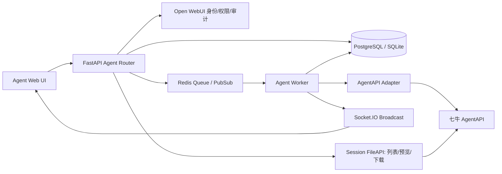

# Open WebUI Agent 模式技术实现方案

## 1. 设计结论

Agent 是与 Chat 平级的会话模式。两种模式共享登录用户、群组、组织、权限和审计能力，但拥有独立的会话、消息协议、路由和前端状态模型。Agent 产出文件由七牛 AgentAPI Session 的 FileAPI 保存和提供。

核心决策如下：

1. 新增 Agent 专用数据表和 API，不在现有 `chat.chat` JSON 中塞入 Agent 事件，也不通过 `meta.type=agent` 伪装 Chat。
2. 每个本地 Agent 会话绑定一个七牛 AgentAPI Session；创建时保存 Agent ID、Version、Environment 的不可变快照。
3. AgentAPI 的每一条事件先写入数据库，再广播到浏览器。Socket.IO 只负责实时通知，不能作为唯一消息存储。
4. 长任务由持久化的 `run/event` 记录和独立 Worker 执行；Redis 用于锁、队列和广播，不承担历史消息的唯一持久化。
5. Agent 使用权限、Agent 会话读取权限、Agent 会话管理权限分开判断。普通用户只能读自己的会话，管理员复用当前 Chat 管理范围。
6. Agent 文件由 Session FileAPI 实时列举并按需流式转发；Open WebUI 只做身份、会话归属和文件权限校验，不复制文件到本地或对象存储，也不向浏览器暴露七牛 API Key。
7. 默认开发环境可以继续使用 SQLite；生产环境推荐 PostgreSQL 和 Redis，并将 Web、Worker 分开部署。Agent 文件不需要额外的对象存储。

## 2. 当前代码基线

当前仓库的相关实现边界如下：

| 能力 | 当前实现 | Agent 方案的使用方式 |
| --- | --- | --- |
| Web 入口 | `backend/open_webui/main.py`，FastAPI/Uvicorn，路由位于 `/api/v1/...` | 增加 Agent 路由和启动 Worker |
| Chat 数据 | `models/chats.py` 的 `chat`、`chat_file`，`models/chat_messages.py` 的 `chat_message` | 不复用 Chat 消息协议，新增 Agent 表 |
| 授权 | `models/access_grants.py` 的 user/group/anyone、read/write grant | Agent 配置使用 grant；会话仍按 owner/admin 范围判断 |
| 群组 | `models/groups.py` | 复用组成员解析和用户选择器 |
| 管理员 Chat 访问 | `ENABLE_ADMIN_CHAT_ACCESS`、`get_user_chat_list_by_user_id` 等逻辑 | Agent 会话列表/详情调用同等管理员判定 |
| 文件 | `models/files.py`、`routers/files.py`、`utils/access_control/files.py` | 借鉴现有鉴权与预览方式；Agent 文件直接使用七牛 Session FileAPI，不写入现有 `file` 表 |
| 实时通信 | `socket/main.py` 的 Socket.IO 和 `events:chat` | 增加独立 Agent 事件名；断线后从数据库补齐 |
| 任务 | `tasks.py` 的进程内 `asyncio.Task`，Redis 为可选临时协调 | 不足以保证重启恢复，Agent 使用持久化 Worker |
| 数据库 | SQLAlchemy Async、Alembic，默认 SQLite，可用 PostgreSQL | 新增 Alembic migration 和索引 |
| 审计 | `AuditLoggingMiddleware` 及现有审计事件 | 为配置、查看、下载、删除和管理操作补充 subject/action |

## 3. 总体架构



### 3.1 进程和部署角色

- **Web**：处理登录、权限、Agent 配置、会话读写、提交 run、文件下载和 Socket.IO 连接。
- **Worker**：领取 `queued/running` run，创建或复用上游 Session，消费事件流，持久化事件，更新终态，并在文件变化时通知前端刷新列表。
- **Scheduler（可选）**：扫描超时 run、回收孤儿锁和触发重试。
- **PostgreSQL**：生产环境的会话、事件、权限快照、游标和审计数据主库。
- **Redis**：分布式锁、队列、实时广播和短期去重缓存。消息历史不只存 Redis。
- **七牛 Session FileAPI**：Agent 产出文件的唯一内容来源。Web 根据当前会话的上游 Session ID 实时列举文件，并在鉴权后流式代理预览/下载。

单实例部署时可先运行 Web 和 Worker 两个进程，使用 SQLite 或 PostgreSQL；多副本部署需要共享数据库和 Redis，并使用租约锁防止同一 run 被多个 Worker 同时消费。Agent 文件不在 Open WebUI 侧落盘。

## 4. AgentAPI 适配层

当前需求只给出了 `Session`、`agent.message`、状态和文件语义，没有附上七牛 AgentAPI 文档正文或链接。因此不在业务层假定具体 URL、HTTP 方法、SSE/WebSocket 帧格式或字段名称，统一通过适配层隔离：

```text
backend/open_webui/agent/
  client.py       # HTTP/SSE/WebSocket、认证、超时、重试
  adapter.py      # 七牛协议 -> Open WebUI 标准事件
  models.py       # Provider/Agent/Session/Run/Event 的内部类型
  worker.py       # 任务领取和执行
  events.py       # 事件校验、去重、排序、状态机
  files.py        # Session FileAPI 列举、归属校验、流式代理
  errors.py       # 可重试/不可重试错误分类
```

业务路由只能调用 `AgentAPIClient`/`AgentAdapter`，不能拼接七牛 URL 或读取 API Key。适配层至少提供以下内部接口：

```text
health_check(config)
create_session(agent_snapshot) -> UpstreamSession
get_session(upstream_session_id)
submit_message(upstream_session_id, request_id, content, attachments)
stream_run(upstream_session_id, upstream_run_id) -> AsyncIterator[NormalizedEvent]
list_session_files(upstream_session_id) -> list[SessionFile]
stream_session_file(upstream_session_id, upstream_file_id, range_header=None) -> AsyncIterator[bytes]
cancel_run(upstream_session_id, upstream_run_id)
delete_session(upstream_session_id)
```

`NormalizedEvent` 统一为：`upstream_event_id`、`sequence`（若上游提供）、`event_type`、`payload`、`terminal_status`、`occurred_at`、`file_refs`。适配层必须保留 `raw_payload`，便于审计和协议升级，但要对密钥、Authorization、Cookie 等字段做脱敏。

需要拿到七牛文档后确认的内容：

- API Key 的 Header、签名或其他鉴权方式及 Key 轮换接口。
- Session 创建、恢复、删除和取消的 HTTP 方法、幂等字段和响应字段。
- 消息提交是同步响应、SSE、WebSocket 还是轮询；事件是否带稳定 ID 和顺序号。
- `agent.message` 的角色、消息类型、思考/进度/工具/正文字段和终态字段。
- Session FileAPI 的文件列表、文件读取、删除和保留期限，以及 `/mnt/session/outputs/` 的可见性语义；确认文件读取是否支持 Range。
- 上游限流、超时、错误码、断点续传和重连规则。

## 5. 数据模型

所有 ID 使用随机 UUID/ULID，外部上游 ID 单独保存。时间字段沿用当前项目的 epoch timestamp 习惯。以下为建议表，字段可按仓库现有 SQLAlchemy 风格实现。

### 5.1 `agent_provider_config`

保存全局七牛服务配置。API Key 加密存储或放在受控 Secret store，API 响应只返回是否已配置和掩码值。

| 字段 | 说明 |
| --- | --- |
| `id` | 单例或配置版本 ID |
| `base_url` | AgentAPI 服务地址 |
| `api_key_ciphertext` | 加密后的 Key，不返回前端 |
| `enabled` | 服务启用状态 |
| `timeout_seconds` | 连接/读取超时 |
| `updated_by`, `updated_at` | 管理审计信息 |

### 5.2 `agent_definition`

| 字段 | 说明 |
| --- | --- |
| `id` | Open WebUI 内部 Agent ID |
| `name`, `description` | 展示信息 |
| `upstream_agent_id` | 七牛 Agent ID |
| `agent_version` | 当前引用版本 |
| `environment_id` | 当前引用环境 |
| `skill_refs` | 七牛 Skill 引用的 JSON |
| `enabled` | 禁用后不能创建新会话 |
| `created_by`, `created_at`, `updated_at` | 管理信息 |

Agent 使用授权建议统一写入 `access_grant`，使用 `resource_type='agent'`、`resource_id=agent_definition.id`。`read` 表示可看到 Agent，`write` 表示可创建/发送会话。若未来需要独立的管理权限，再增加 `manage` 维度或使用现有 workspace 权限，而不是把管理权限授给普通 grant。

### 5.3 `agent_conversation`

| 字段 | 说明 |
| --- | --- |
| `id` | 本地会话 ID |
| `owner_user_id` | 会话创建者 |
| `agent_definition_id` | 创建时所选 Agent |
| `upstream_session_id` | 七牛 AgentAPI Session ID，唯一 |
| `snapshot_agent_id` | 创建时快照 |
| `snapshot_agent_version` | 创建时快照 |
| `snapshot_environment_id` | 创建时快照 |
| `title` | 本地标题 |
| `status` | `active/running/completed/failed/cancelled/deleting/deleted` |
| `archived`, `deleted_at` | 本地生命周期 |
| `last_event_sequence`, `last_read_at` | 补齐和未读状态 |
| `created_at`, `updated_at` | 时间 |

对 `upstream_session_id` 建唯一索引；创建会话后永远使用快照字段，不回读 Agent 当前版本，避免管理员修改配置影响历史会话。

### 5.4 `agent_run`

一次用户提交对应一个 run。

| 字段 | 说明 |
| --- | --- |
| `id` | 本地 run ID |
| `conversation_id` | 所属会话 |
| `client_request_id` | 客户端幂等键，按会话唯一 |
| `upstream_run_id` | 上游 run ID |
| `input_event_id` | 用户输入事件 |
| `status` | `queued/running/succeeded/failed/cancelled/unknown` |
| `attempt`、`next_retry_at` | 重试控制 |
| `lease_owner`、`lease_expires_at` | Worker 租约 |
| `error_code`、`error_message` | 脱敏错误 |
| `started_at`、`finished_at` | 执行时间 |

唯一约束建议为 `(conversation_id, client_request_id)`，防止浏览器重试创建两个相同任务。

### 5.5 `agent_event`

每一条用户消息、`agent.message`、思考、进度、工具调用、工具结果、状态和错误都保存为独立事件。

| 字段 | 说明 |
| --- | --- |
| `id` | 本地事件 ID |
| `conversation_id`, `run_id` | 所属会话和 run |
| `upstream_event_id` | 上游稳定 ID（如有） |
| `sequence` | 本地单调序号 |
| `event_type` | `user.message`、`agent.message`、`agent.thought`、`tool.call`、`tool.result`、`run.status`、`error` 等 |
| `display_content` | 前端展示内容，可为空 |
| `payload_json` | 结构化内容 |
| `raw_payload_json` | 脱敏后的原始事件 |
| `created_at` | 入库时间 |

唯一约束使用 `(run_id, upstream_event_id)`；没有上游 ID 时使用 `(run_id, upstream_sequence)` 或规范化 payload 哈希。这样重连和上游重复推送不会重复污染消息。`agent.message` 严格一条事件对应一个展示消息，不能按 run 合并。

### 5.6 Session 文件

Agent 文件不新建 `agent_artifact` 内容表，也不写入现有 `file` 表。文件内容和当前文件列表以七牛 Session FileAPI 为准；本地 `agent_conversation.upstream_session_id` 是取得文件的关联依据。文件事件保留在 `agent_event` 中，记录上游文件 ID、文件名等原始元数据，供消息历史和审计使用，但不作为下载授权依据。

前端每次进入会话、收到文件事件及 run 结束时，通过后端查询 Session FileAPI 获取文件名、类型、大小和生成时间。运行中可低频刷新，以发现未在消息事件中引用的产出文件。后端可以短时缓存文件列表，但必须按 Session 隔离；下载前仍需向 Session FileAPI 验证文件属于该 Session。

该设计要求七牛 Session 文件的保留期限覆盖产品承诺的会话保留期限。若上游会提前清理文件，Open WebUI 无法在不保存副本的前提下保证历史文件持续可下载，必须先确认上游保留策略，不能仅靠本地元数据声称文件仍可用。

## 6. AgentAPI 调用和任务流程

### 6.1 创建会话

1. 前端调用 `POST /api/v1/agent-sessions`，提交 `agent_id` 和可选标题。
2. 后端验证当前用户身份、Agent `enabled`、Agent 使用 `write` 权限和 Provider 已启用。
3. 后端读取 Agent 配置并写入版本/环境快照。
4. 调用适配层创建七牛 Session；成功后在同一事务中写入 `agent_conversation`。
5. 上游创建失败不写入可见会话，或写入 `creation_failed` 后由清理任务回收，不能返回没有上游 Session 的“可用会话”。

### 6.2 发送消息

1. 前端立即将输入置为本地 pending，并带 `client_request_id`。
2. `POST /api/v1/agent-sessions/{id}/runs` 做会话读取/写入权限检查和状态检查。
3. 事务写入 `agent_run(status=queued)` 与 `agent_event(event_type=user.message)`，提交后返回 `run_id`。
4. Worker 领取 run，使用会话保存的 `upstream_session_id` 提交消息，不创建新 Session。
5. Worker 收到每个 AgentAPI 事件后：校验 -> 去重 -> 写 `agent_event` -> 更新 run/conversation 状态 -> 广播 Socket.IO。发现文件事件或 run 结束时通知前端重新查询 Session 文件列表。
6. 收到明确终态后写 `succeeded/failed/cancelled`；没有终态但连接中断时写 `unknown` 或按协议进入重连，不直接标记成功。

### 6.3 事件处理原则

- 事件入库和广播顺序固定为“数据库提交后广播”。
- 前端事件包含 `conversation_id`、`run_id`、`event_id`、`sequence`、`event_type`。
- 前端不依赖实时事件补发；重连先调用历史接口，按 `sequence` 补齐后再订阅。
- 上游乱序时先落库，读取接口按 sequence/created_at 排序；若协议只支持顺序流，则由适配层分配本地序号。
- 原始 payload 必须大小限制和敏感字段脱敏。若上游返回超大事件，适配层需定义截断或分页策略；不能假设 Agent 文件能替代事件历史。

## 7. 长任务、断线恢复和并发控制

### 7.1 Worker 租约

Worker 从 Redis 队列或数据库扫描领取 queued run，在数据库中原子更新 `lease_owner/lease_expires_at`。处理期间定期续租；租约过期后其他 Worker 可接管。一个会话默认只允许一个 active run，除非七牛协议明确支持并发消息，否则发送新消息时返回 409。

### 7.2 服务重启恢复

启动时扫描：

- `queued`：重新入队。
- `running` 且租约过期：标记为 `unknown`，按上游能力执行 `get_run`/重连；无法查询时进入有限重试，最终标记 `failed` 并说明结果未知。
- `succeeded/failed/cancelled`：不重放，不重复调用上游。

浏览器断开只影响 Socket.IO 连接，不取消 Worker。用户重新进入会话时按会话详情、事件分页、产出文件列表加载最新状态。

### 7.3 事件幂等

优先使用上游事件 ID；没有稳定 ID 时使用上游 sequence，仍没有时使用“run + 类型 + 序号 + payload hash”。数据库唯一约束是最终防线，Redis 去重只做性能优化，不能作为正确性依据。

## 8. 权限、管理员审计和文件安全

### 8.1 三层权限

1. **Agent 使用权限**：用户是否能看到 Agent、创建会话和发送消息。由 `access_grant(resource_type='agent')` 的 read/write 与群组成员关系决定。
2. **会话读取权限**：普通用户只能读取 `owner_user_id == user.id` 的会话；共享/审计读取走明确的会话权限函数。
3. **会话管理权限**：删除、归档、共享、取消和查看审计数据，分别复用当前 Chat 的用户权限和管理员规则。

管理员读取员工 Agent 会话时，调用与 Chat 相同的 `ENABLE_ADMIN_CHAT_ACCESS` 和管理员检查路径。当前代码主要是全局 admin + 开关语义，因此 v1 应保持这一实际行为；如果部署版本已经有组织/上级范围，应抽出共享的 `can_manage_user_content(actor, owner, resource_type)`，让 Chat 和 Agent 共用，而不是复制一套范围判断。

### 8.2 文件下载

`GET /api/v1/agent-sessions/{session_id}/files/{file_id}/download` 必须按以下顺序检查：登录 -> 本地会话存在 -> 当前用户有会话读取权限 -> 调用 Session FileAPI 校验 `file_id` 属于该 `upstream_session_id` -> 从上游响应流式转发。不能接受客户端传入任意上游 URL、Session ID 或绕过会话校验的文件 ID。

文件列表由 `GET /api/v1/agent-sessions/{session_id}/files` 实时查询 Session FileAPI，展示文件名、MIME、大小、生成时间和预览能力。支持预览的类型可复用现有 FileNav 组件；未知类型只提供下载。下载、预览均由后端代理，浏览器只看到 Open WebUI 路由，不看到 API Key。

### 8.3 密钥和审计

- API Key 只在后端配置页提交，存储时加密或使用 Secret Manager。
- 不返回前端，不写浏览器存储，不写完整请求日志；异常日志只记录配置 ID 和脱敏 URL。
- Agent 配置创建/修改/启停、会话查看、事件导出、文件下载、取消/删除、重试都写现有审计体系。
- 管理员查看员工内容时记录 actor、owner、conversation、run、动作和结果，不记录完整消息正文到审计日志。

## 9. 后端 API 建议

路由沿用 `/api/v1`，实际 Pydantic 字段以仓库命名规范为准：

```text
GET    /api/v1/agent-config
PUT    /api/v1/agent-config
POST   /api/v1/agent-config/test

GET    /api/v1/agents
POST   /api/v1/agents
GET    /api/v1/agents/{agent_id}
PATCH  /api/v1/agents/{agent_id}
DELETE /api/v1/agents/{agent_id}
PUT    /api/v1/agents/{agent_id}/access

POST   /api/v1/agent-sessions
GET    /api/v1/agent-sessions
GET    /api/v1/agent-sessions/{session_id}
DELETE /api/v1/agent-sessions/{session_id}
PATCH  /api/v1/agent-sessions/{session_id}/archive

POST   /api/v1/agent-sessions/{session_id}/runs
GET    /api/v1/agent-sessions/{session_id}/runs
GET    /api/v1/agent-sessions/{session_id}/events?after_sequence=...
GET    /api/v1/agent-sessions/{session_id}/files
GET    /api/v1/agent-sessions/{session_id}/files/{file_id}/download
POST   /api/v1/agent-runs/{run_id}/cancel
POST   /api/v1/agent-runs/{run_id}/retry
```

所有详情、事件和文件接口都由服务端从当前用户推导权限，不接受 `owner_user_id` 作为授权依据。列表接口需要分页，事件接口支持 `after_sequence`/`limit`，避免长会话一次返回全部 payload。

建议统一错误码：`AGENT_DISABLED`、`AGENT_FORBIDDEN`、`SESSION_NOT_FOUND`、`SESSION_CLOSED`、`RUN_CONFLICT`、`UPSTREAM_TIMEOUT`、`UPSTREAM_RATE_LIMITED`、`UPSTREAM_PROTOCOL_ERROR`、`SESSION_FILE_NOT_FOUND`、`SESSION_FILE_EXPIRED`。返回给用户的 `error_message` 要可理解，内部 traceback 只进服务端日志。

## 10. 前端页面和交互

### 10.1 用户端

新增独立入口和 URL，例如：

```text
src/routes/(app)/agents/+page.svelte
src/routes/(app)/agents/[id]/+page.svelte
src/lib/apis/agents/index.ts
src/lib/components/agents/
```

Sidebar 明确显示 Chat/Agent 两个入口；Chat 使用既有 `/c/{chat_id}`，Agent 使用 `/a/{agent_session_id}`。创建页先选择已授权 Agent，再创建会话。Agent 页面独立实现消息列表和状态栏，不复用普通 Chat 的 assistant message 协议。

事件展示至少区分：用户消息、`agent.message`、思考、进度、工具调用、工具结果、文件产出、运行中、成功、失败、取消。每条 `agent.message` 单独渲染和保存；正文、思考和工具事件可以折叠，但不能合并丢失边界。运行状态来自服务端 `agent_run.status`，有终态就不得继续显示 working。

页面初始化顺序：获取会话详情 -> 获取事件分页 -> 查询 Session FileAPI 文件列表 -> 连接 Socket.IO -> 使用最后 sequence 订阅增量。收到文件事件或 run 结束时刷新文件列表；断线重连重复该过程，允许重复事件但由前端 event_id 去重。

### 10.2 管理端

建议新增：

```text
src/routes/(app)/workspace/agents/+page.svelte
src/routes/(app)/workspace/agents/[id]/+page.svelte
src/routes/(app)/workspace/agents/settings/+page.svelte
```

复用 Workspace 的表格、用户/群组选择器、AccessGrant UI 和现有 Chat 管理页面的筛选模式。管理端提供 Provider 配置、Agent CRUD、版本/环境/Skill 引用、启停、访问授权、会话审计查看和文件查看；API Key 只提供掩码状态和重新配置，不提供读取接口。

## 11. 生命周期规则

### 11.1 Agent 配置

- 禁用 Agent：禁止新建会话；已有会话默认允许继续，便于完成已开始的任务。管理员可提供“同时停止已有会话”的显式操作。
- 修改 Version/Environment/Skill：只影响新会话；历史会话继续使用快照。
- 删除 Agent 定义：采用软删除。存在活动会话时只隐藏新建入口，保留历史会话的显示名称和快照。

### 11.2 会话和上游 Session

- 创建本地会话必须绑定上游 Session。
- 删除进入 `deleting`，先拒绝新 run，再尝试取消活动 run 和删除上游 Session。
- 上游删除成功或确认不可恢复后标记本地 `deleted`；上游接口暂时不可用时保留 `deleting`，由 Scheduler 重试。
- 本地历史事件和审计默认软删除/保留策略由组织合规要求决定。Session 删除后，文件是否还能访问由七牛 Session/FileAPI 的删除和保留语义决定，不能在 Open WebUI 本地伪造文件副本状态。

### 11.3 文件

文件不在 Open WebUI 本地落盘，不执行对象存储上传和本地文件清理。删除会话时按七牛 Session API 的生命周期规则删除或关闭上游 Session；之后文件由七牛侧负责清理。Open WebUI 只保留事件中的脱敏文件元数据，并在文件访问时重新验证上游文件是否仍存在。

## 12. 异常、重试和取消

| 场景 | 处理 |
| --- | --- |
| 连接超时/临时 5xx | 指数退避有限重试，携带原 request_id；超过上限标记 failed/unknown |
| 429 限流 | 读取 Retry-After，更新 `next_retry_at`，不立即忙等 |
| 鉴权失败 | 不重试，暂停相关 run，管理员收到配置错误提示 |
| 上游事件重复 | 唯一约束去重，继续消费 |
| 上游事件乱序 | 保存原始事件，使用 sequence 排序；协议不支持时分配本地序号 |
| Worker 崩溃 | 租约过期后恢复或标记 unknown，避免重复提交 |
| 浏览器断开 | Worker 继续运行，结果写库 |
| 用户重试 | 新建 run，保留原 run 和事件；除非客户端 request_id 相同，否则不覆盖历史 |
| 用户取消 | 写 cancel requested，调用上游取消；取消失败显示“取消处理中/结果未知” |
| 文件下载失败 | 返回上游错误并保留文件元数据，可单独重试 FileAPI 下载，不重跑整个 Agent run |

重试必须区分“提交消息失败”和“已提交后读取流失败”。已拿到上游 run ID 后不能盲目再次提交消息，优先调用上游恢复/查询接口，避免重复执行。

## 13. 数据迁移与兼容

1. 新增 Alembic migration 创建 Agent 表、索引和约束，不修改现有 `chat`、`chat_message` 的含义。
2. 新增配置默认值 `agent.enabled=false`，未配置七牛服务时现有 Chat 完全不受影响。
3. 不迁移历史 Chat 为 Agent；Agent 只接受新建会话。
4. 如果复用 `access_grant`，补充资源类型白名单和查询索引；旧 grant 数据保持兼容。
5. Agent 文件不写入现有 `file` 表，不增加本地文件副本；只保存 Session FileAPI 返回的必要展示元数据和事件记录。
6. 灰度启用时按管理员、组织或用户白名单开启 Agent UI；关闭 Feature Flag 时保留已持久化事件和会话清理能力。
7. 数据库升级、回滚和 Worker 版本发布必须分两步：先发布兼容 schema，再发布使用新字段的代码。

## 14. 测试计划

### 14.1 单元测试

- AgentAPI 适配层：鉴权、超时、SSE/WebSocket 解码、字段兼容和错误分类。
- 事件归一化：每条 `agent.message` 独立保存，重复/乱序/缺序号处理正确。
- 状态机：queued -> running -> terminal，非法状态迁移被拒绝。
- 权限：用户/群组 grant、owner、管理员开关、禁用 Agent、已删除会话。
- 文件安全：错误 file ID、跨 Session ID、上游过期文件、管理员范围。
- 脱敏：API Key、Authorization、Cookie 不出现在响应和日志。

### 14.2 集成测试

- 创建会话、持续复用同一上游 Session、多个 run 的数据隔离。
- Worker 重启、租约接管、重复事件、断线后补齐。
- AgentAPI 超时、429、5xx、鉴权失败、取消和上游删除失败。
- Session FileAPI 文件列举、流式下载、预览、上游文件过期和会话删除。
- PostgreSQL 和 SQLite migration；Redis 开启/关闭两种模式。

### 14.3 端到端和验收测试

- Chat/Agent 入口、URL、会话列表互不混淆，不能相互切换。
- 普通员工只能看到授权 Agent 和自己的会话。
- 管理员按 Chat 当前范围查看员工 Agent 会话和文件，并产生审计记录。
- 刷新、重新登录、浏览器断网、Web 重启后消息、状态和文件仍完整。
- 负载测试长输出、多事件、多文件和并发会话；验证事件分页、数据库索引和 Session FileAPI 流式下载。

## 15. 分阶段实施计划

### 阶段 0：协议和边界确认

拿到七牛 AgentAPI 文档和测试环境，确认 Session、run、事件流、文件、鉴权、取消、幂等和限流语义；产出适配层契约和错误码表。

### 阶段 1：数据与适配层

完成 Alembic 表、权限查询服务、Provider 加密配置、AgentAPI client/adapter、脱敏日志和健康检查。此阶段不开放用户 UI。

### 阶段 2：最小可用会话

完成 Agent 列表、授权、创建会话、发送消息、事件持久化、事件查询和 Socket.IO 增量通知；支持单 Worker 和基本重试。

### 阶段 3：长任务与文件

加入持久化 Worker、租约恢复、服务重启接管、取消/重试、Session FileAPI 文件列表、流式下载和预览。

### 阶段 4：管理员能力和审计

复用 Chat 管理范围，完成员工会话查看、筛选、导出/共享/删除规则、文件审计、Agent 启停和版本/环境快照验证。

### 阶段 5：灰度和生产化

启用 PostgreSQL/Redis 部署，执行迁移演练、压测、安全测试和灰度 Feature Flag；确认 Session FileAPI 保留策略、监控指标和告警后扩大范围。

## 16. 监控和运维指标

- AgentAPI 请求成功率、P50/P95 延迟、429/5xx/鉴权失败数。
- queued/running run 数、运行时长、重试次数、unknown 数和租约接管数。
- 每个会话事件写入延迟、事件重复率、Socket 推送失败率。
- Session FileAPI 文件列表/下载成功率、上游文件过期数、代理流中断数。
- 权限拒绝、跨会话访问尝试、管理员查看/下载审计事件。

日志使用 request_id、conversation_id、run_id、upstream_session_id（可脱敏）关联，禁止记录 API Key 和完整敏感 payload。生产环境应设置事件和原始 payload 的保留期限，并明确七牛 Session/FileAPI 的文件保留期限。

## 17. 验收标准映射

需求中的 1~5 由独立入口、Agent CRUD、`access_grant` 和启停控制覆盖；6~9 由 conversation 快照、run/event 持久化、Worker 租约和重连补齐覆盖；10~11 由 Session FileAPI 文件列表、会话归属校验和后端流式代理下载覆盖；12~13 由 Chat 管理范围复用和 owner 检查覆盖；14~15 由生命周期状态机、加密配置和脱敏审计覆盖；16 通过新增表、路由和 Feature Flag 保证现有 Chat 不改协议、不迁移数据。

七牛 AgentAPI 文档补齐后，需把本方案第 4 节的适配接口映射为具体 endpoint/事件字段，并用官方沙箱跑通“创建 Session -> 多条 agent.message -> 文件列举/下载 -> 取消/删除”的契约测试，之后才进入阶段 1 的编码实现。
